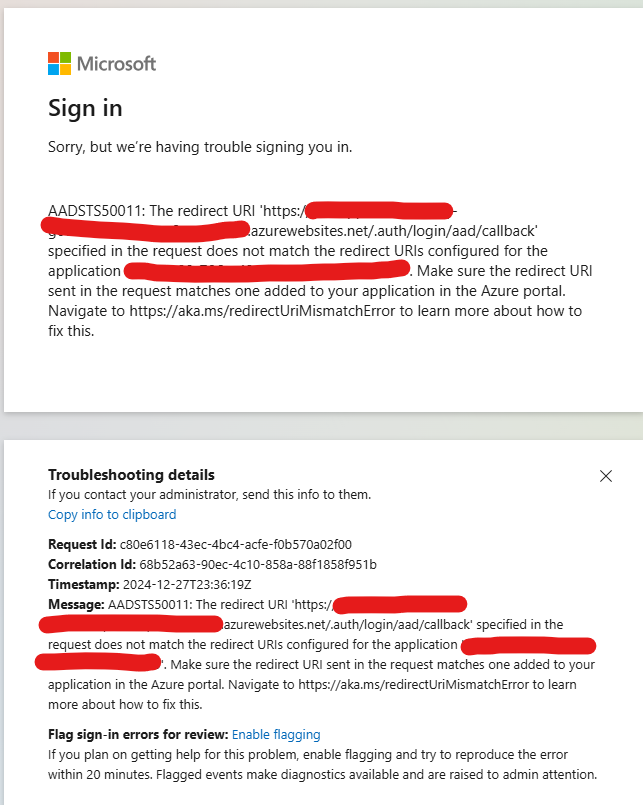
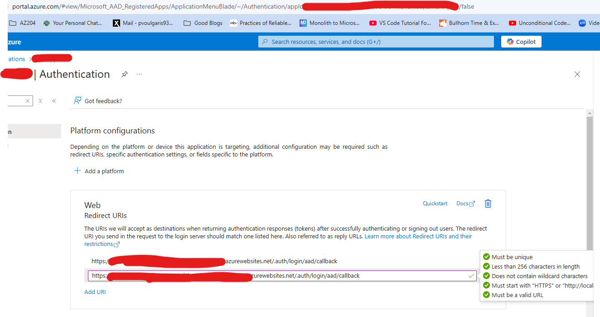

# Azure App Service Notes

## `Thursday, 12/27/24`

- Working through `Deployment Slot` exercise in Chapter 2.
- Was encountering the following error, when going to my _stage_ deployment slot website:

- Followed the instructions [here](https://learn.microsoft.com/en-us/answers/questions/567933/how-to-troubleshoot-the-error-aadsts50011) and [here](https://learn.microsoft.com/en-us/troubleshoot/entra/entra-id/app-integration/error-code-AADSTS50011-redirect-uri-mismatch) and [here](https://stackoverflow.com/questions/50011686/aadsts50011-the-reply-url-specified-in-the-request-does-not-match-the-reply-url) and that worked:

## General Notes

- `VNet Integration`
  - Only available with `Basic`, `Standard` and `Premium` plans
- `Deployment Slots`
  - `Standard` or `Premium` required

- [Team Blog](https://azure.github.io/AppService/)
- [Tutorials](https://azure.github.io/AppService/zero-to-hero/)

## Sunday, 8/18/24

### Azure App Service Plans

#### App Service Plan

- An `App Service` always runs within an `App Service Plan`
- An `App Service Plan` defines a set of compute resources for a web app to run
- Creating an `App Service Plan`:
  - [App Service Plan](https://learn.microsoft.com/en-us/azure/app-service/quickstart-dotnetcore?tabs=net80&pivots=development-environment-cli)
  - `http://<app-name>.azurewebsites.net`

## Sunday, 8/11/24

- Working through `Chapter 2` of `Developing Solutions for Microsoft Azure AZ-204 Exam Guide`

# Sunday, 7/14/24

### `Azure App Service` App

- Working through tutorials, esp. with `terraform`
  - [Overview](https://learn.microsoft.com/en-us/azure/app-service/overview)