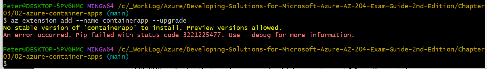
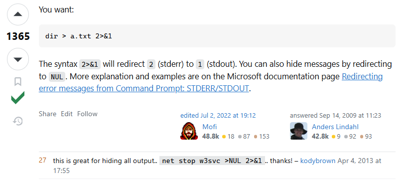
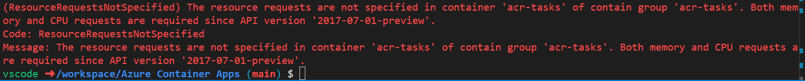
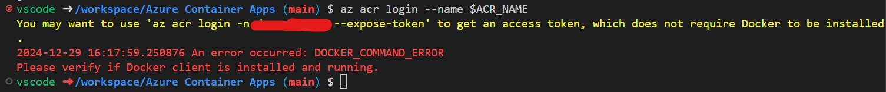

# Troubleshooting

## Working through `Developing Solutions for Microsoft Azure AZ-204 Exam Guide`

## Getting errors on Task: `Creating an ACA Environment`:

- Note, as of `12/29/24`, moving on from this issue, it's a stupid roadblock to progress at this point...



- To copy the output to a log file, redirecting standard error _AND_ standard out to the file:

```bash
az extension add --name containerapp --upgrade --debug > 2024-12-29-01-error-log.txt 2>&1
```

- [This](https://stackoverflow.com/questions/1420965/how-can-i-redirect-windows-cmd-standard-output-and-standard-error-to-a-single-fi) was helpful:



## Getting these errors on Task: `Creating an ACI`:

- Note, as of `12/29/24`, was not able to resolve this. Moving on for now.





- Following [these](https://learn.microsoft.com/en-us/answers/questions/1289158/container-image-unable-to-pull-private-azure-conta) instructions

- Could be related to [this](https://stackoverflow.com/questions/73210679/az-acr-login-raises-docker-command-error-with-message-docker-daemon-not-running)

- I am, after all, trying to run this all from a devcontainer...
- [This](https://learn.microsoft.com/en-us/cli/azure/install-azure-cli-linux?pivots=apt)
