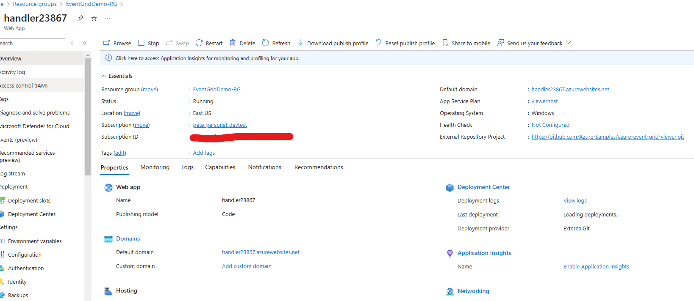

# Azure Event Grid

## `Thursday, 12/26/24` &rarr; `Event Grid Notes`

- Note that `Event Grid` supports multiple possible subscribers for an event, while `Event Hub` does not
- This is a _topic_
- `Event Grid` can act as a _message broker_. An application can submit custom events to the public endpoint and they can be delivered to subscribers
- _Event Handlers_ or _Subscribers_. `Event Grid` can trigger the following _subscribers_: `Azure Automation` runboos, `Logic Apps`, `Azure Functions`, `Event Hubs`, `Service Bus` and `Azure Queue Storage`
- A _Topic_ is a one-to-many relationship between the _event source_ and the _event handler_ and is implemented by `Event Grid`
- An individual _Subscription_ is made by the event handler with the the _specific_ `Event Grid` topic for which it wants to receive events
- Handling of _Event Topics_ with `Event Grid` vs. _Event Processing_ with `Event Hub`

### Schema

- Two (2) types of schema formats. The _default_ and the `CloudEvent` schema
- `CloudEvent` is intended for _multi-cloud_ scenarios
- `JSON` format including _type_ of event (`eventType`), `subject`, `topic`, `id` and `version`, for example
- Event _payload_ is polymorphic and stored in the `data` field
- Fields that exist in the default event schema can be used for _filtering_
- Maximum size of an _event_ is one (1) MB

### Access Management

- Handled by `Azure Active Directory` and _access keys_ or _SAS_ keys
- Can be generated for access to _topics_ and _subscriptions_
- A `SAS` key is the preferrable way to provide specific rights
- Can also use `Azure AD` identities to provide _role-based_ access to _topics_ and _subscriptions_

### Event Grid Domains

- `Azure Event Hubs` temporarily persists events unti they are pulled, while `Azure Event Grid` is responsible for _persisting_ and _delivering_ events to _subscribers_
- Thus, in the event of a _communication_ errors, `Azure Event Grid` can **retry** delivery of the event, e.g., `Delivery Retries`
- Customization for how long to keep trying and how many times, is available
- Can also specify a _dead-letter queue_ for events that can't be delivered
- `Delivery Retry` and `Dead-Letter Queue` configuration are optional and not configured by default
- **Default configuration drops undeliverable events**

### Filters

- Based on a specific _field_ (key) of the event
- Custom filter can be built

### Troubleshooting `demo.ps1`

- [Install AZ](https://azurelessons.com/the-term-new-azresourcegroup-is-not-recognized/)
- [Update AZ and Login](https://azurelessons.com/the-new-azresourcegroup-command-was-found/)
- I was able to run the script, but kept getting erros relating to parameters on the `New-AzEventGridSubscription` call
- Moving on from this demo for now...

### Pricing Model

- `Azure Event Grid` is based on the _consumption_ model without fixed monthly charges
- Charges based on bulk operations are the first 100,000 operations
- Operations include _ingress_ attempts plus _retrying_ attempts to deliver the event
- Total charges calculated by multiplying the subscribed handler's counts by the number of delivered events

### Provisioning

- Two (2) resources: The `Event Topic` and the `Event Subscription`

### Working Through Last Sample in Chapter 12

- `.env` file (after running provisioning script):

```text
CUSTOM_TOPIC_ENDPOINT="***"
CUSTOM_TOPIC_ACCESS_KEY="***"
```

- Really cool Demo, see screenshots!

#### Comments

- Note `App Service` has deployment slots, but you need _Standard_ or _Premium_ to use them:



- It has a `Default Domain` that we can navigate to in the browser
- It is linked to an `External Repository Project`, in this case an _Azure Event Grid Viewer_ sample app
- Can add custom domains
- Can enable _Application Insights_
- It is hosted by an `App Service Plan` named _viewerhost_
- As noted, current _Sku_ is `Free (F1)`
- _Virtual network integration_ is not supported on the `Free (F1)` plan
- Note, there are _Outbound_ IP addresses and a Virtual IP address
- Scaling supported at the `App Service Plan` level

## General

- See PDF document/slides from Matthew Soucoup

## Getting Started with this sample

- To use this sample create a `.env` and populate the following environment variables, as desired:

```bash
UNIQUE_STRING=****
RESOURCE_GROUP_NAME=****
REGION=****
TOPIC_NAME="****-egtopic-$UNIQUE_STRING"
SITE_NAME="****-egsite-$UNIQUE_STRING"
TEMPLATE_URI="https://raw.githubusercontent.com/Azure-Samples/azure-event-grid-viewer/main/azuredeploy.json"
SITE_URL="https://$SITE_NAME.azurewebsites.net"
```

## Details

- Designed to implement a _publish/subscribe_ pattern
- Multiple publishers, multiple subscribers
- Temporarily store the events unless a _subscriber_ can process them
- _Ingress_ connections by services to produce events and streams (_publishers_)
- _Egress_ connections by services (_consumers_) to receive the events for further processing
- Event hubs can support Apache Kafka
- Target for Azure resources such as VM's, app services, databases and networking resources
- Logs can be forwarded to external _Security Information and Event Management_ systems (SIEMS)
- Event hub _namespace_ is a virtual server, a logical container for hubs and can provide isolation and management features for access control
- Provide _namespace_, receive _fully-qualified domain name_ (FQDN)
- Can be managed from firewall and supports MQ Telemetry Transport (MQTT) and Advanced Message Queue Protocol (AMQP) over WebSockers and HTTPS

## Event Types

- Discrete: report state changes and are actionable - EventGrid
- Series: report a condition, time-ordered and analyzable - EventHub
- User Notification: prompt user or their device for attention - Notification Hub

## Pricing Model

- Basic Tier - No dynamic partition scaling, capturing events or VNet integration. Retention is limited to one (1) day
- Standard Tier - Can capture events in a storage account, integrate with VNets and retention up to seven (7) days
- Premium Tier - Expensive tier with no throughput limits and a retention period of 90 days
- Dedicated Tier - Same as premium but provisioned in an exclusive single-tenant environment

## Scaling

- Highly scalable service by extending the number of throughout units and processing units
- Basic and Standard up to 40 throughput units, responsible for ingress and egress traffic
- Premium allows horizontal scaling by increasing the _processing_ units. No throughput limits
- Premium processing unit equivalent to approximately 10 throughput units of the Basic and Standard tiers. Premium can scale up to 16 _processing_ units

## Partitions

- Number of partitions configured in privisioning step, minimum of one (1) and can not be changed later
- Number of _partitions_ should correspond to number of _throughput_ units, roughly
- Recommended number of partitions can be calculated from the planned solution throughput
- A _partition_ is a logically separated queue, operating in first-in-first-out (FIFO) pattern
- Service will load-balance subscribers among the available partitions, if there are more partitions that subscribers
- If all partitions already have a single subscriber, any new subscriber won't be able to connect

## Capturing Events

- Event _capturing_ is available for Standard and Premium Price where the event can still be available in the blob storage, even after expiration of the retention period
- Extra charges may apply

## Consumer Groups

- Used to perform independent read of events by an application
- Number of subscribers should not exceed five (5) consumers per group
- This topic is a little hazy to me, come back to it

## Event Consumption Services

- Azure Event Grid is designed for communication between cloud and on-premises applications and services
- Azure services can consume, process and analyze events from Event Hub
- Azure Event Grid can be connected to Azure Event Hub as a bridge to Azure Queue Storage, Azure Service Bus, Azure Functions, Azure Cosmos DB, etc.
- Azure Stream Analytics to process events and ingest them into Azure Blob Storage, Azure Queue Storage, Azure Service Bus, Azure Cosmos DB, Azure Synapse Analalytics and Power BI datasets
  - Compared to Azure Event Grid, sophisticated filtering algorithms, including leveraging Azure Machine Learning Services
- Big data ingestion via Azure Synapse Data Explorer and Azure Databricks solution

## Authentication & Authorization

- Shared Access Signature (SAS) tokens used to authenticate and authorize publishers and consumers with listen, send and manage rights
- Managed Identifies - both user-assigned and system-assigned

```text
Left-off at `Developing Applications for Event Hubs` &rarr; `Sunday, 11/22/24`
```
