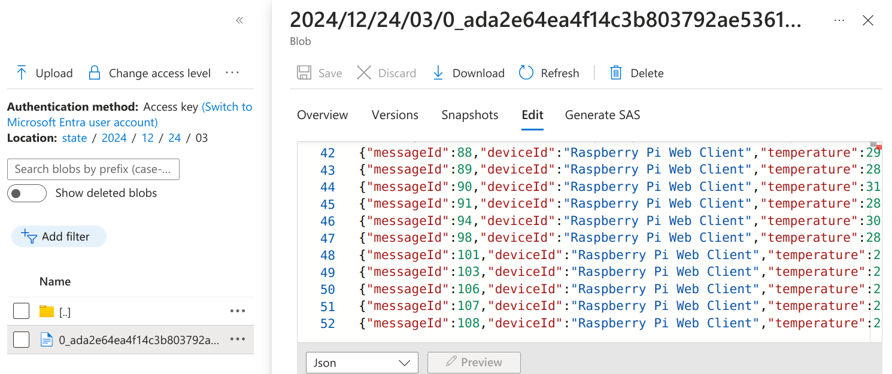

# Azure IoT Hub

## `Monday, 12/23/24`

- Working through `Chapter 12` on `Azure IoT Hubs` in [Developing-Solutions-for-Microsoft-Azure-AZ-204-Exam-Guide-2nd-Edition](https://github.com/PacktPublishing/Developing-Solutions-for-Microsoft-Azure-AZ-204-Exam-Guide-2nd-Edition)
- Looks like it's just the infrastructure setup script, then run the tool from [here](https://azure-samples.github.io/raspberry-pi-web-
  simulator/)
- [Here](https://github.com/Azure-Samples/Iot-Telemetry-Simulator) is another simulator, written in .NET
- Very cool, see screen-shot:

