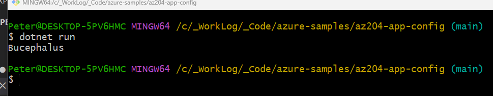
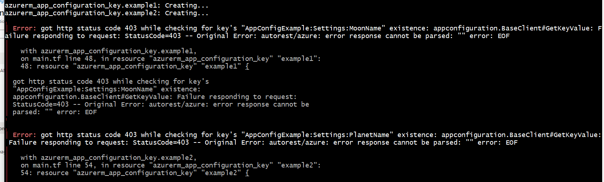
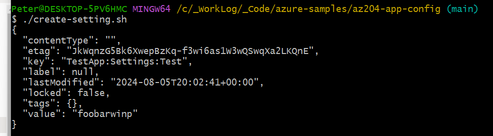
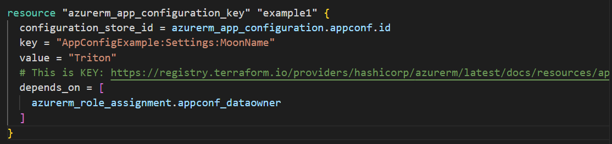
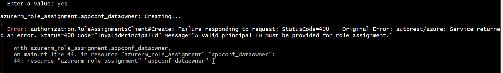
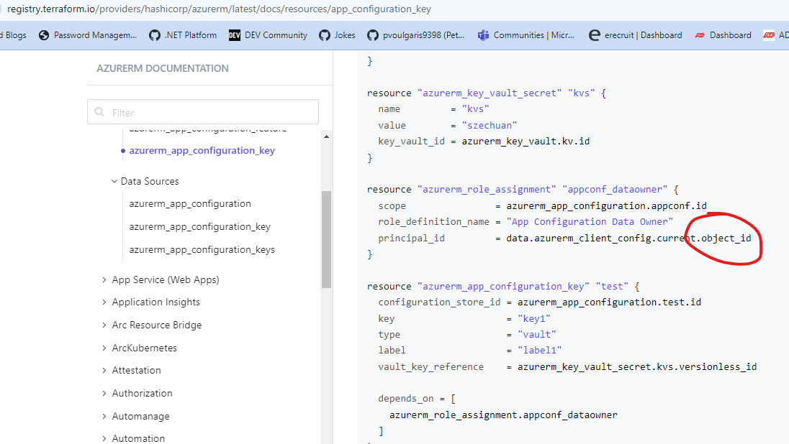
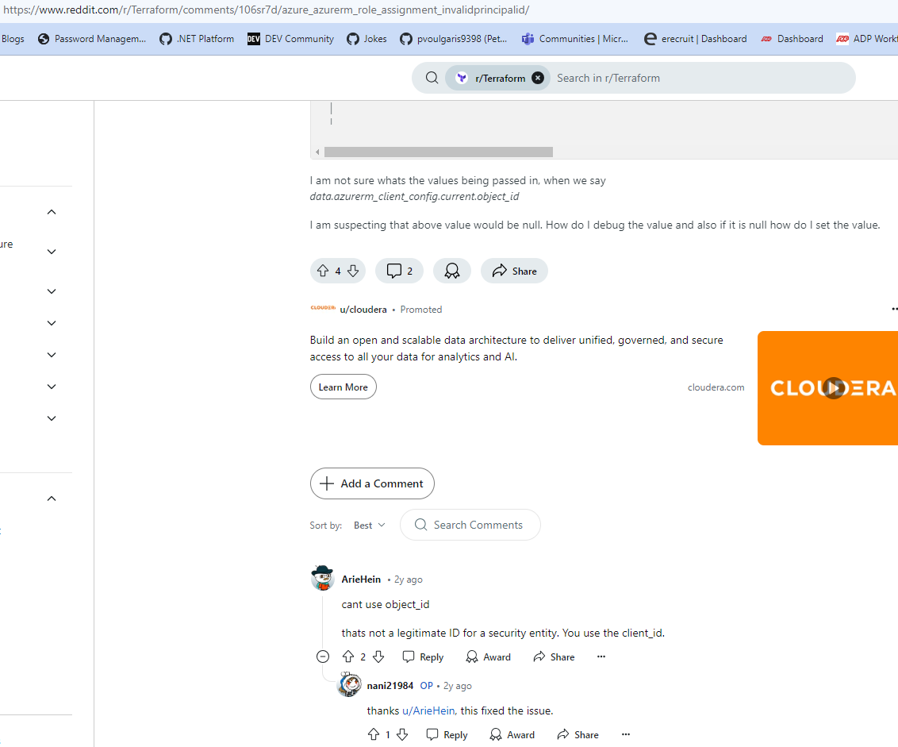

# App Configuration Example

- Working through [this](https://learn.microsoft.com/en-us/azure/azure-app-configuration/quickstart-azure-app-configuration-create?tabs=azure-portal) sample

- Run `terraform init`
- Run `terraform apply`
- Navigate to `Azure` portal, create a setting per the instructions
- Navigate to `App Configuration` &rarr; `Settings` &rarr; `Access Settings`
- Grab a `Connection String`, update the `.env` file
- Run `dotnet run` from root of this sample:



- Having trouble getting my `terraform` to automatically create settings, see:



- But I can do via `az` command line:



```bash
az appconfig kv set --name app-config-dev01 --key TestApp:Settings:Test --value foobarwinp --yes
```

- Needed to add [depends_on](https://registry.terraform.io/providers/hashicorp/azurerm/latest/docs/resources/app_configuration_key)



- Progress:



```text
authorization.RoleAssignmentsClient#Create: Failure responding to request: StatusCode=400 -- Original Error: autorest/azure: Service returned an error. Status=400 Code="InvalidPrincipalId" Message="A valid principal ID must be provided for role assignment."
```

- Apparently the circled entry needs to be `client_id` instead of `object_id`:



- See entry [here](https://www.reddit.com/r/Terraform/comments/106sr7d/azure_azurerm_role_assignment_invalidprincipalid/)

- Although, this is taking a long time \
(I seem to remember creating a service principal in the past took a _long_ time)



- Not sure what's up with that, but not looking good. It's going on 6 minutes and still working...

- As of this time `8/5/24 5:34 PM1` I am not able to use `terraform` to create the app settings, for some reason. \
None of the things I've tried seem to work
- **BUT**, I _can_ create the settings via the az command-line, see `create-setting.sh` \
and the Azure Portal
- And see them queried from my sample app, after updating the connection string