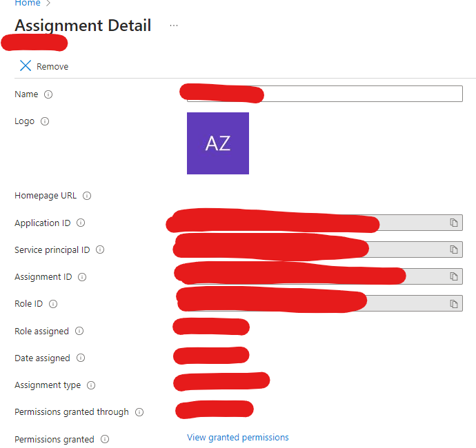

# AZ204 Microsoft Identity Example

## Tuesday, 8/6/24

- Dusted off this sample and realized I had hard-coded `client_id` and `tenant_id` values in the code
- Removed them, added `.env` file and code to load environment variables when running
- But was wondering where dit the `client_id` come from, because when running, a login browser opened \
and then the code ran successfully.
- See this entry (it appears to be used for `Graph`)

- `Application ID` &rarr; `Client ID`
- I need to work on understanding exactly what an _Application_ **IS** in this context.
