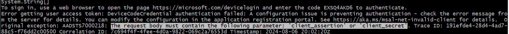

# Microsoft Graph Example/Sample

- Following example [here](https://learn.microsoft.com/en-us/graph/tutorials/dotnet?tabs=aad)
- Was getting the following error, when following this sample:

- See this [issue](https://stackoverflow.com/questions/45609432/how-do-i-resolve-the-error-aadsts7000218-the-request-body-must-contain-the-foll)
- **That worked!**